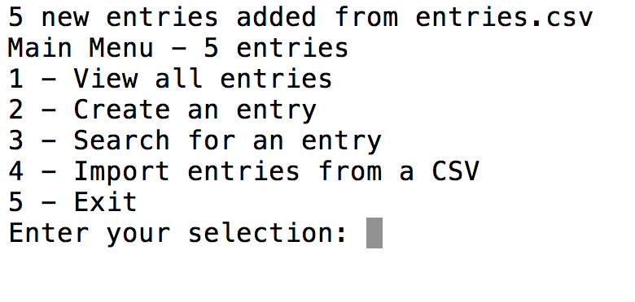

## Address Bloc
#### Written in Ruby

Address Bloc is a command line address book application using Test-Driven Development.

#### Features:
Interactive command-line menu that allows users to view entries, create entries, search for a specific entry, import entries from a CSV file, and exit the program.

